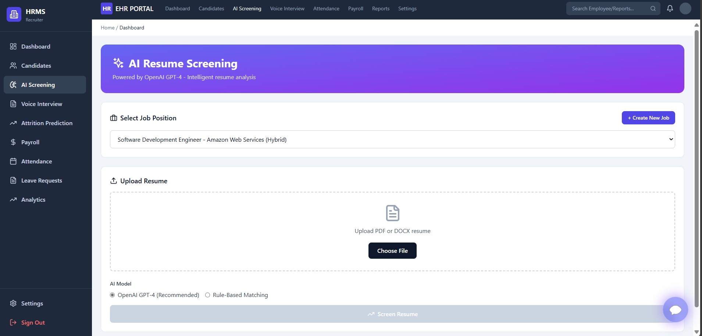
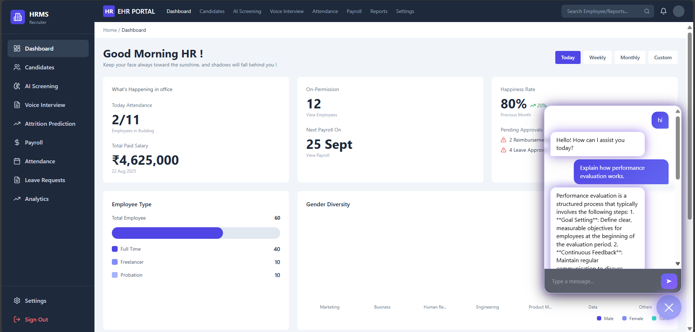
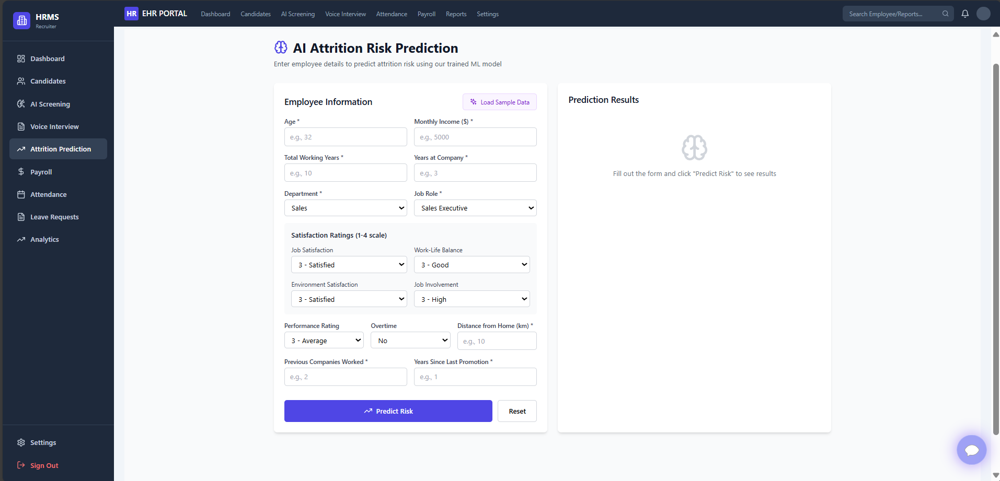
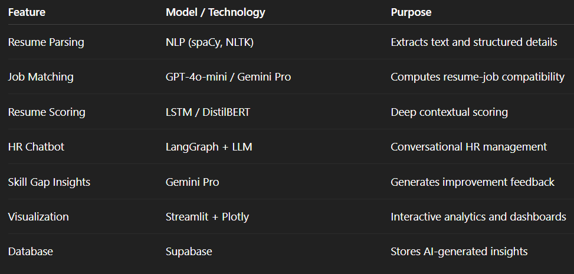

# Team member 1
- Diksha Khandelwal 
- diksha1010.dk@gmail.com
- Amity Univeristy, Noida
# Team member 2
- Shivika Mittal
- shivika2934@gmail.com
- Amity Univeristy, Noida
# Team member 3
- Vaishnavi Sharma
- sharma.v2044@gmail.com
- Amity Univeristy, Noida

# Enterprise HRMS Platform

A modern, intelligent, and scalable Human Resource Management System with AI-powered features for recruitment, performance tracking, payroll management, and predictive analytics.

## Features

### Core HRMS Modules
- **Employee Management** - Complete employee lifecycle management with profiles, departments, and organizational hierarchy
- **Attendance Tracking** - Real-time attendance monitoring with check-in/check-out functionality
- **Payroll Management** - Automated salary processing with deductions, allowances, and tax calculations
- **Performance Tracking** - Comprehensive performance reviews and goal management

### AI-Powered Features
- **Resume Screening** - Automated candidate evaluation with AI scoring and skill extraction
- **Voice Interview Bot** - Interactive voice-based candidate screening with sentiment analysis
- **Attrition Prediction** - Machine learning models to identify at-risk employees
- **Predictive Analytics** - Data-driven insights for HR decision making

### Role-Based Dashboards

#### Admin Dashboard
- Company-wide HR operations overview
- Department analytics and workforce metrics
- Attrition risk analysis by department
- Hiring trends and payroll distribution
- AI-generated insights and recommendations

#### Recruiter Dashboard
- AI-powered resume screening with bulk upload
- Candidate pipeline management
- Voice interview bot integration
- Skills analysis and candidate scoring
- Recruitment analytics and metrics

#### Manager Dashboard
- Team performance monitoring
- Attendance and productivity tracking
- AI-powered team insights
- Employee attrition risk alerts
- Performance review management

#### Employee Dashboard
- Personal attendance and leave management
- Payroll information and salary slips
- Performance reviews and career growth insights
- Self-service features for profile updates

## Technology Stack

- **Frontend**: React 18 + TypeScript
- **Styling**: Tailwind CSS
- **Database**: Supabase (PostgreSQL)
- **Authentication**: Supabase Auth with role-based access control
- **Icons**: Lucide React
- **Build Tool**: Vite

## AI Features 

## AI-Powered HR Management System

An integrated AI module for smarter recruitment, automated screening, and intelligent HR operations. It combines resume intelligence, contextual evaluation, and conversational automation to enhance efficiency and transparency.

### 1. AI Resume Scanner (FastAPI + OpenAI GPT)

* Extracts skills, experience, and education from PDF/DOCX resumes using NLP.
* Matches candidate profiles to job descriptions with AI-based scoring and feedback.
* Generates match scores, skill gap analysis, and improvement suggestions.

**Tech Stack:** FastAPI · Python · OpenAI API · pdfplumber · python-docx
**Endpoint Example:** `POST /api/match-resume` - returns AI-based resume evaluation.

---

### 2. Intelligent Resume Screening (Streamlit + LSTM + Gemini Pro)

* Multi-model evaluation combining rule-based, LSTM, and transformer-based analysis.
* Provides real-time dashboards for skill trends, candidate ranking, and model performance.
* Secure data storage and analytics via Supabase (PostgreSQL).

**Tech Stack:**· TensorFlow · PyTorch · Hugging Face · Supabase · Plotly



---

### 3. AI Chatbot Assistant (LangGraph + LLM)

* Conversational HR assistant for natural language queries.
* Supports employee lookup, scheduling, and record management.
* Uses LangGraph for structured workflows and human-in-the-loop validation.

**Models Used:** OpenAI GPT · Anthropic Claude



---

### 4. **Attrition & Performance Prediction Model (ML + FastAPI)**

* Predicts **employee attrition risk** and **performance levels** using historical HR data.
* Uses **Gradient Boosting and Random Forest classifiers** trained on features like experience, role, salary, performance score, and tenure.
* Provides **department-wise attrition probability** and individual employee risk scores.
* Integrated into the **Admin and Manager Dashboards** for early intervention and workforce planning.
* Continuously improves through **data-driven retraining** and feedback loops for better accuracy.

**Tech Stack:** Python · FastAPI · scikit-learn · Pandas · Supabase (PostgreSQL) · Plotly

**Endpoint Example:**
`POST /api/predict-attrition` - returns predicted attrition risk and performance score for each employee.




### AI Integration Overview



---

### Key AI Models

* **GPT-4o-mini** – Resume understanding and scoring
* **Gemini Pro** – Candidate suitability and insights
* **Custom LSTM** – Deep contextual scoring
* **DistilBERT** – Semantic similarity detection
* **LangGraph** – Structured AI workflow orchestration

---

### Visualization & Analytics

* Skill distribution and job trend analysis
* Salary vs. experience insights
* Model performance comparison
* WordClouds for trending domains

## Getting Started

### Prerequisites
- Node.js 18+ installed
- Supabase account with a project set up

### Setup Instructions

1. **Clone the repository**
   ```bash
   git clone <repository-url>
   cd hrms-platform
   ```

2. **Install dependencies**
   ```bash
   npm install
   ```

3. **Configure environment variables**

   The `.env` file should already contain your Supabase credentials:
   ```env
   VITE_SUPABASE_URL=your-supabase-url
   VITE_SUPABASE_ANON_KEY=your-supabase-anon-key
   ```

### Environment variables (backend + frontend)

This project uses a few `.env` files for different services. The frontend expects Vite-style variables (prefixed with `VITE_`) while the backend and auxiliary services use plain names.

- Primary backend `.env` (located at `ai-resume-scan/.env`) — contains sensitive service keys and API tokens. Example (redacted):

```properties
# OpenAI API Configuration (do NOT commit your real key)
OPENAI_API_KEY=your-openai-api-key-here

# Supabase (server) - used by backend services
SUPABASE_URL=https://your-supabase-project.supabase.co
SUPABASE_KEY=your-service-role-or-admin-key

# Optional: frontend-compatible environment variables
VITE_SUPABASE_URL=https://your-supabase-project.supabase.co
VITE_SUPABASE_ANON_KEY=your-supabase-anon-key
```


4. **Database setup**

   The database schema has been automatically applied via migrations. The following tables are created:
   - profiles (user profiles with roles)
   - departments
   - attendance
   - payroll
   - performance_reviews
   - candidates
   - ai_screening_results
   - voice_interview_results
   - attrition_predictions
   - leave_requests

5. **Start the development server**
   ```bash
   npm run dev
   ```

6. **Build for production**
   ```bash
   npm run build
   ```

## User Roles

The system supports four user roles with distinct permissions:

1. **Admin** - Full system access, manages all HR operations
2. **Senior Manager** - Department-level access, manages team performance
3. **Recruiter** - Recruitment pipeline and candidate management
4. **Employee** - Self-service access to personal information

## Creating Your First User

1. Navigate to the login page
2. Click "Sign Up"
3. Fill in your details and select a role
4. Sign in with your credentials

For testing, you can create users with different roles to explore all dashboards.

## Key Features by Module

### AI Resume Screening
- Bulk resume upload (PDF/DOC support)
- Automatic skill extraction using NLP
- AI-powered job fit scoring (0-100)
- Customizable score thresholds
- Detailed candidate profiles with fit explanations
- Export screening reports

### Voice Interview Bot
- Structured question flow covering multiple categories
- Real-time voice recording and transcription
- Sentiment and confidence analysis
- Communication and technical ratings
- AI-generated hiring recommendations
- Complete interview scorecards

### Analytics Dashboard
- Department-wise attrition risk visualization
- Monthly hiring vs attrition trends
- Performance rating distribution
- Payroll analytics by department
- Productivity tracking over time
- AI-generated insights and alerts

### Security & Access Control
- Row Level Security (RLS) on all tables
- Role-based access policies
- Secure authentication with Supabase Auth
- Data isolation by department and role
- Audit trails for sensitive operations

## Database Schema

The platform uses a comprehensive PostgreSQL schema with the following key tables:

- **profiles** - Extended user information linked to auth.users
- **departments** - Organizational structure
- **candidates** - Job applicant information
- **attendance** - Daily attendance records
- **payroll** - Salary and payment information
- **performance_reviews** - Employee evaluations
- **attrition_predictions** - AI-generated risk assessments
- **leave_requests** - Leave management
- **ai_screening_results** - Resume screening data
- **voice_interview_results** - Interview analysis data

All tables have appropriate RLS policies ensuring data security and role-based access.

## Development

### Project Structure
```
src/
├── components/
│   ├── dashboards/      # Role-specific dashboard components
│   ├── features/        # Feature modules (AI screening, etc.)
│   ├── shared/          # Reusable UI components
│   └── Login.tsx        # Authentication component
├── contexts/
│   └── AuthContext.tsx  # Authentication state management
├── lib/
│   └── supabase.ts      # Supabase client and types
├── App.tsx              # Main application component
└── main.tsx            # Application entry point
```

### Code Organization
- Components are organized by feature and responsibility
- Shared components promote reusability
- TypeScript for type safety
- Clean separation of concerns

## Future Enhancements

- Real-time notifications system
- Advanced analytics with custom reports
- Multi-language support
- Mobile application
- Integration with third-party HR tools
- Advanced AI models for better predictions
- Video interview capabilities
- Document management system
- Learning management integration

## Support

For issues, questions, or contributions, please open an issue in the repository.

## License

This project is proprietary software. All rights reserved.
